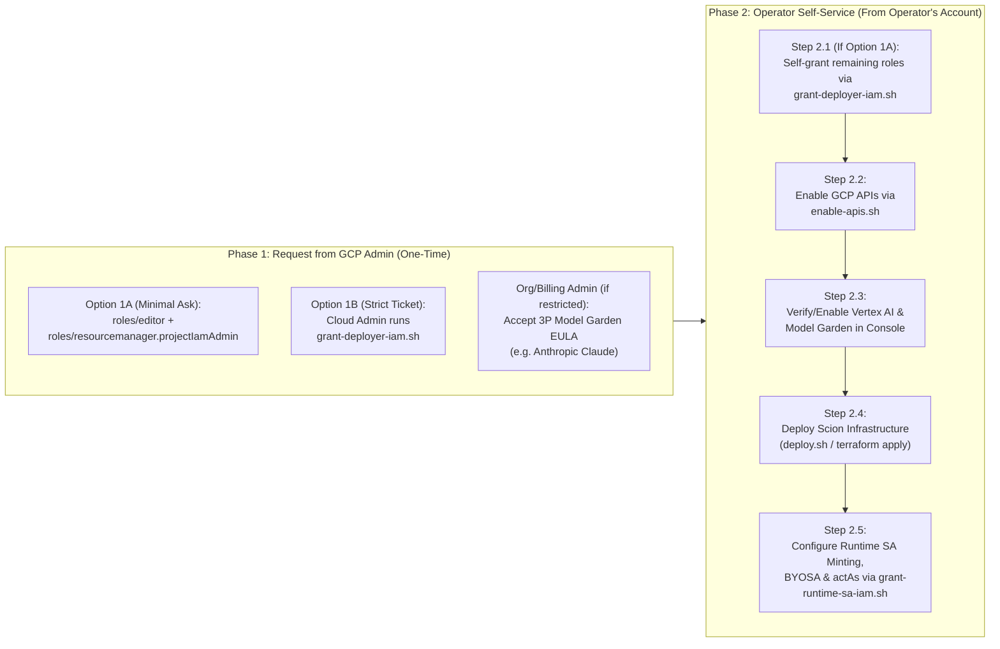

# Scion GCP IAM, Permissions & Model Garden Setup

Reference guide and bootstrap scripts for configuring **Google Cloud IAM roles, Service Accounts, APIs, and Vertex AI / Model Garden access** across all [Scion](https://github.com/GoogleCloudPlatform/scion) deployment modes.

This guide is split into **two distinct phases** so there is zero ambiguity between:
1. **[Phase 1 — What the Operator Must Request to Get Started](#phase-1--what-the-operator-must-request-to-get-started)** *(Executed once by a GCP Project Owner / Cloud Admin before the operator begins)*
2. **[Phase 2 — What the Operator Runs After Receiving Access](#phase-2--what-the-operator-runs-after-receiving-access)** *(Executed end-to-end by the operator from their own account)*



---

## Pre-Flight Check: Validate Your Permissions (`validate-permissions.sh`)

Before running any deployment or filing an IAM request, run [`scripts/validate-permissions.sh`](scripts/validate-permissions.sh) (100% read-only, no Scion repo required, creates no resources) to check whether your current `gcloud` account already has what is needed:

```bash
# Check if you have the Phase 1 bootstrap permissions (Option 1A: editor + projectIamAdmin)
./scripts/validate-permissions.sh --project <GCP_PROJECT_ID> --tier phase1-bootstrap

# Check if you have all permissions and enabled APIs for a specific tier (vm, hybrid, cloudrun, ha-gcloud, ha-terraform, or full-operator)
./scripts/validate-permissions.sh --project <GCP_PROJECT_ID> --tier full-operator --check-apis
```

- If you already hold `resourcemanager.projects.setIamPolicy` (Option 1A) and are only missing additive roles, `validate-permissions.sh` prints the exact `./scripts/grant-deployer-iam.sh` command you can run **yourself** to self-grant them.
- If you do not hold `resourcemanager.projects.setIamPolicy`, it prints the exact **Phase 1** commands to send to your Cloud Admin.

---

## Phase 1 — What the Operator Must Request to Get Started

### Why `roles/editor` Alone Is Never Enough
`roles/editor` includes resource creation (`compute.*`, `run.*`, `iam.serviceAccounts.create`), Service Account attachment (`iam.serviceAccounts.actAs`), and API enablement (`serviceusage.services.enable`). **However, `roles/editor` contains zero `*.setIamPolicy` permissions**—so it fails whenever deployment scripts or Terraform attempt to bind project IAM roles, service-account token-creator policies, Cloud Run invoker policies, Secret Manager per-secret policies, or IAP access policies.

Depending on your organization's IAM governance, choose **Option 1A** or **Option 1B** when requesting access from your Cloud / IAM Admin:

---

### Option 1A: Minimal "Self-Bootstrap" Request (Recommended — Only 2 Roles)

If your organization allows project-level IAM delegation, ask your GCP Project Owner / Cloud Admin for **just two roles** on the target project:

| Role to Request from Cloud Admin | Why It Is Needed in Phase 1 |
| :--- | :--- |
| **`roles/editor`** | Base resource creation, `iam.serviceAccounts.create`, `iam.serviceAccounts.actAs`, and `serviceusage.services.enable`. |
| **`roles/resourcemanager.projectIamAdmin`** | Grants `resourcemanager.projects.setIamPolicy` on the project. **With this single additive role, the operator can self-grant all remaining Cloud Run, SA Admin, IAP, Secret Manager, and GKE roles from their own account in Phase 2** without filing another IAM ticket. |

**Commands for the Cloud Admin to run (Option 1A):**
```bash
gcloud projects add-iam-policy-binding <GCP_PROJECT_ID> \
  --member="user:operator@example.com" \
  --role="roles/editor"

gcloud projects add-iam-policy-binding <GCP_PROJECT_ID> \
  --member="user:operator@example.com" \
  --role="roles/resourcemanager.projectIamAdmin"
```

---

### Option 1B: Strict Upfront IAM Ticket (When Self-Granting Is Restricted)

If your organization prohibits granting `roles/resourcemanager.projectIamAdmin` to operators (or requires every role to be approved upfront in an IAM ticket), ask the Cloud Admin to run `grant-deployer-iam.sh` for your account—or request the roles in **Table 1.1** below.

**Command for the Cloud Admin to run (Option 1B):**
```bash
./scripts/grant-deployer-iam.sh \
  --project <GCP_PROJECT_ID> \
  --member user:operator@example.com \
  --tier full-operator \
  --include-editor
```

#### Table 1.1: Full Operator Account Permissions (What the Operator Needs to Configure Everything)

| Role on Operator Account (`user:operator@example.com`) | Key Permissions Provided | What It Unlocks for the Operator |
| :--- | :--- | :--- |
| **`roles/editor`** *(Base role)* | `iam.serviceAccounts.create`, `iam.serviceAccounts.actAs`, `serviceusage.services.enable`, compute/storage/SQL CRUD | Creates base GCP resources, creates Service Accounts, attaches SAs to VMs/Cloud Run, and enables APIs. |
| **`roles/resourcemanager.projectIamAdmin`** | `resourcemanager.projects.getIamPolicy`<br>`resourcemanager.projects.setIamPolicy` | Grants project-level IAM roles to the Hub, Transport, and Agent Service Accounts during deployment. |
| **`roles/iam.serviceAccountAdmin`** | `iam.serviceAccounts.create`<br>`iam.serviceAccounts.delete`<br>`iam.serviceAccounts.setIamPolicy` | Binds SA-level policies: grants `serviceAccountTokenCreator` on Transport/Agent SAs and `workloadIdentityUser` for GKE Workload Identity. |
| **`roles/iam.serviceAccountUser`** | `iam.serviceAccounts.actAs` | Attaches SAs to workloads **and** ensures the operator passes Policy Troubleshooter `actAs` checks when `gcp_iam_check_mode: enforce` is enabled. |
| **`roles/iam.securityReviewer`** | `iam.roles.get`, `resourcemanager.projects.getIamPolicy` | Inspects IAM policies and tests Policy Troubleshooter v3 `actAs` checks from the operator account. |
| **`roles/run.admin`** | `run.services.create`, `run.services.update`<br>`run.services.setIamPolicy` | Deploys Cloud Run Hub / IAP Proxy services and binds `roles/run.invoker` for the IAP service agent and Transport SA. |
| **`roles/iap.admin`** | `iap.web.setIamPolicy`<br>`iap.webServices.setIamPolicy` | Enables Identity-Aware Proxy on Cloud Run and manages IAP access bindings for users and the Transport SA. |
| **`roles/iap.httpsResourceAccessor`** | `iap.webServiceVersions.accessViaIAP` | **Critical for operator login:** Allows the operator themselves to pass through IAP to open the Scion Web UI and run `scion` CLI commands against the Hub. |
| **`roles/iap.tunnelResourceAccessor`** | `iap.tunnelInstances.accessViaIAP` | Allows the operator to SSH into private Single-Node / Hybrid GCE VMs via `gcloud compute ssh --tunnel-through-iap`. |
| **`roles/secretmanager.admin`** | `secretmanager.secrets.create`<br>`secretmanager.secrets.setIamPolicy`<br>`secretmanager.versions.add` | Creates secrets and sets per-secret IAM bindings (`google_secret_manager_secret_iam_member` in Terraform HA requires `secretmanager.secrets.setIamPolicy`, which `editor` lacks). |
| **`roles/compute.networkAdmin`** | `compute.networks.get`, `compute.networks.create`, `compute.networks.updatePolicy`, `compute.subnetworks.get`, `compute.subnetworks.list`, `compute.subnetworks.create`, `compute.subnetworks.use`, `compute.routers.*`, `compute.firewalls.get`, `compute.firewalls.list`, `compute.firewalls.create`, `compute.firewalls.update`, `compute.firewalls.delete` | Creates and modifies VPCs (`<GCP_PROJECT_ID>`), regional subnets, Cloud Router/NAT, Direct VPC Egress attachments (`compute.subnetworks.use`), and VPC firewall rules (`compute.networks.updatePolicy` + `compute.firewalls.*`). |
| **`roles/servicenetworking.networksAdmin`** | `servicenetworking.services.addPeering` | Establishes Private Service Access VPC peering for private Cloud SQL and Cloud Filestore instances. |
| **`roles/container.admin`** | `container.clusters.*`, `container.pods.*`, Kubernetes RBAC admin | Creates GKE Autopilot clusters, binds K8s RBAC (`ClusterRole`/`RoleBinding`), and allows the operator to run `kubectl` against agent pods. |
| **`roles/storage.admin`** | `storage.buckets.create`<br>`storage.buckets.setIamPolicy`<br>`storage.objects.*` | Creates GCS buckets for Scion templates/workspaces and binds bucket-level IAM policies. |
| **`roles/aiplatform.admin`** | `aiplatform.endpoints.*`, Vertex AI admin permissions | Configures Vertex AI and enables/accepts Model Garden models in the GCP Console. |
| **`roles/serviceusage.serviceUsageAdmin`** | `serviceusage.services.enable`, `serviceusage.quotas.*` | Enables required `*.googleapis.com` APIs and manages project service quotas. |

#### Table 1.2: Minimum Deployer Roles by Architecture Tier (If Scoping Down the Request)

| Role (in addition to `roles/editor`) | Single-Node VM (`vm`) | Hybrid Tier (`hybrid`) | Cloud Run Sandbox (`cloudrun`) | HA via `gcloud` (`ha-gcloud`) | Multi-Hub HA Terraform (`ha-terraform`) | Full Operator (`full-operator`) |
| :--- | :---: | :---: | :---: | :---: | :---: | :---: |
| `roles/resourcemanager.projectIamAdmin` | ✅ | ✅ | ✅ | ✅ | ✅ | ✅ |
| `roles/run.admin` | ✅ | ✅ | ✅ | ✅ | ✅ | ✅ |
| `roles/iap.admin` | ✅ | ✅ | ✅ | ✅ | ✅ | ✅ |
| `roles/compute.networkAdmin` | ✅ | ✅ | — | — | ✅ | ✅ |
| `roles/iam.serviceAccountAdmin` | — | ✅ | ✅ | ✅ | ✅ | ✅ |
| `roles/iam.serviceAccountUser` | *(in editor)* | *(in editor)* | ✅ | ✅ | *(in editor)* | ✅ |
| `roles/secretmanager.admin` | — | — | — | — | ✅ | ✅ |
| `roles/servicenetworking.networksAdmin` | — | — | — | — | ✅ | ✅ |
| `roles/container.admin` | — | *(in editor)* | — | *(in editor)* | ✅ | ✅ |
| `roles/storage.admin` | — | — | — | — | ✅ | ✅ |
| `roles/iap.httpsResourceAccessor` | ✅ | ✅ | Recommended | Recommended | Recommended | ✅ |
| `roles/iap.tunnelResourceAccessor` | ✅ | ✅ | — | — | — | ✅ |
| `roles/aiplatform.admin` | Recommended | Recommended | Recommended | Recommended | Recommended | ✅ |
| `roles/iam.securityReviewer` | Optional | Optional | Optional | Optional | Optional | ✅ |

---

### Table 1.3: Non-Project-IAM Requests (Org / Billing / Marketplace)

Check whether your organization restricts these two items outside standard project IAM; if so, include them in your Phase 1 admin request:

| Item | When You Need Admin Help | What to Request |
| :--- | :--- | :--- |
| **Vertex AI Model Garden Partner Terms (e.g., Anthropic Claude)** | When GCP Marketplace / 3P partner procurement is restricted at the Billing Account or Organization level. | Ask a Billing/Procurement Admin (`roles/consumerprocurement.orderAdmin` + `roles/aiplatform.admin`) to open **GCP Console → Vertex AI → Model Garden** in `<GCP_PROJECT_ID>` and **Enable / Accept Terms** for the required partner models (e.g., Claude Sonnet/Opus), **OR** grant your account `roles/consumerprocurement.orderAdmin` so you can accept them in Phase 2. |
| **Organization Policy Constraints** *(Hardened GCP Orgs only)* | If the org enforces strict `constraints/iam.allowedPolicyMemberDomains` or `constraints/compute.vmExternalIpAccess`. | Follow Scion's Hardened Org setup (use private IPs + Cloud NAT + IAP TCP forwarding; no `allUsers` IAM bindings are needed when using IAP). |

---

## Phase 2 — What the Operator Runs After Receiving Access

Once Phase 1 is complete, **every step below is executed by the operator from their own terminal and GCP account.**

---

### Step 2.1: Self-Grant Remaining Operator Roles *(Only if you used Option 1A)*

If the Cloud Admin granted you `roles/editor` + `roles/resourcemanager.projectIamAdmin` in Phase 1, run `grant-deployer-iam.sh` **from your own account** to grant yourself the remaining resource-level `setIamPolicy`, IAP, Secret Manager, and Vertex AI admin roles:

```bash
./scripts/grant-deployer-iam.sh \
  --project <GCP_PROJECT_ID> \
  --member user:<YOUR_EMAIL> \
  --tier full-operator
```

*(If your Cloud Admin already ran Option 1B for you, skip to Step 2.2.)*

---

### Step 2.2: Enable Project GCP APIs (`*.googleapis.com`), Project VPC (`<GCP_PROJECT_ID>`) & Direct VPC / IAP Firewall Rules

From your operator account, enable all required GCP APIs for your deployment tier (`vm`, `cloudrun`, `hybrid`, `ha`, or `all`). The script automatically batches calls into chunks of `<= 15` services to stay within GCP Service Usage's 20-service batch limit (`SU_MAX_BATCH_SIZE_EXCEEDED`).

Pass `--ensure-vpc` so the script inspects `<GCP_PROJECT_ID>` and ensures:
1. A VPC network named **`<GCP_PROJECT_ID>`** (rather than `default`) and its regional subnet exist.
2. The IAP TCP forwarding firewall rule **`<GCP_PROJECT_ID>-allow-iap-ssh`** (`35.235.240.0/20` → `tcp:22`) is applied on network `<GCP_PROJECT_ID>` so `gcloud compute ssh --tunnel-through-iap` succeeds during VM setup.
3. The Cloud Run Direct VPC Egress firewall rule **`<GCP_PROJECT_ID>-allow-proxy`** (`<SUBNET_CIDR>` → `tcp:8080`) is applied on network `<GCP_PROJECT_ID>` so the Cloud Run IAP proxy (`--network=<GCP_PROJECT_ID> --subnet=<SUBNET> --vpc-egress=all-traffic`) can reach the private Hub VM on port `8080` (since custom VPCs do not include a `default-allow-internal` rule).

```bash
./scripts/enable-apis.sh \
  --project <GCP_PROJECT_ID> \
  --tier all \
  --ensure-vpc
```

#### Table 2.1a: Required VPC Firewall Rules & Direct VPC Egress Permissions (Cloud Run IAP Proxy → Hub VM)

| Layer / Principal | Rule or Permission | Source / Scope | Target / Port | Why It Is Required |
| :--- | :--- | :--- | :--- | :--- |
| **VPC Firewall Rule (`INGRESS`)** | `scion-hub-<hub>-allow-proxy` / `<GCP_PROJECT_ID>-allow-proxy` | Regional Subnet CIDR (e.g. `10.128.0.0/20`) on VPC `<GCP_PROJECT_ID>` | `tcp:8080` (`--target-tags=scion-hub-<hub>`) | Cloud Run Direct VPC Egress allocates internal IPs from `--subnet=<SUBNET>`. Allows the IAP proxy to forward HTTP/WebSocket traffic to `http://<VM_IP>:8080`. |
| **VPC Firewall Rule (`INGRESS`)** | `scion-hub-<hub>-allow-iap-ssh` / `<GCP_PROJECT_ID>-allow-iap-ssh` | `35.235.240.0/20` *(Google IAP TCP range)* | `tcp:22` (`--target-tags=scion-hub-<hub>`) | Allows `gcloud compute ssh --tunnel-through-iap` to reach the `--no-address` Hub VM during setup and maintenance. |
| **Operator / Deployer IAM** | `compute.firewalls.{get,list,create,update,delete}`<br>`compute.networks.{get,create,updatePolicy}`<br>`compute.subnetworks.{get,list,create,use}` | Project (`roles/compute.networkAdmin` or `roles/editor`) | VPC `<GCP_PROJECT_ID>` & Regional Subnet | `compute.networks.updatePolicy` is required to attach/update firewall rules on the VPC; `compute.subnetworks.use` is required to attach Cloud Run Direct VPC Egress and the GCE VM to the subnet. |
| **Cloud Run Service Agent** | `service-<PROJECT_NUMBER>@serverless-robot-prod.iam.gserviceaccount.com` | Project (`roles/run.serviceAgent`; or `roles/compute.networkUser` on Shared VPC) | Regional Subnet | Leases `/26` internal IP blocks from `<SUBNET>` (`compute.subnetworks.use`, `compute.addresses.*`) for Cloud Run Direct VPC Egress instances. |
| **IAP Service Agent** | `service-<PROJECT_NUMBER>@gcp-sa-iap.iam.gserviceaccount.com` | Cloud Run Proxy Service (`roles/run.invoker`) | `<hub>-iap-proxy` | Allows Google Identity-Aware Proxy to invoke the Cloud Run proxy service after authenticating end-user HTTPS requests. |

#### Table 2.1: GCP APIs Enabled by Tier (21 Services)

| GCP Service API | Required By Tier | Purpose in Scion |
| :--- | :--- | :--- |
| `serviceusage.googleapis.com` | All | Enables and inspects GCP service APIs and quotas on the project. |
| `cloudresourcemanager.googleapis.com` | All | Project metadata resolution and project-level IAM policy bindings. |
| `iam.googleapis.com` | All | Service Account creation, Hub SA minting (`IAMAdminClient`), and SA IAM policies. |
| `iamcredentials.googleapis.com` | All | Short-lived token generation (`generateAccessToken`, `generateIdToken`) & `signBlob` for GCS signed URLs. |
| `compute.googleapis.com` | All | GCE VMs, VPC networks, subnets, Cloud Router/NAT, firewall rules. |
| `run.googleapis.com` | All | Hub Cloud Run service, Single-Node VM IAP proxy, or Cloud Run Sandbox. |
| `iap.googleapis.com` | All | Identity-Aware Proxy authentication for Web UI, CLI, and agent transport tokens. |
| `cloudbuild.googleapis.com` | All | Checked by Single-Node VM and Cloud Run deployment scripts during image/source setup. |
| `secretmanager.googleapis.com` | All | Dynamic storage for User, Project, and Hub secrets (`scion-<hub_hash>-*`). |
| `storage.googleapis.com` | All | GCS bucket storage for agent templates, workspaces, and artifacts. |
| `artifactregistry.googleapis.com` | All | Container image registry for Scion Hub, IAP proxy, and agent harness images. |
| `aiplatform.googleapis.com` | All (Vertex AI) | Vertex AI & Model Garden inference endpoints (Gemini, Claude on Vertex). |
| `policytroubleshooter.googleapis.com` | All (`enforce`/`log`) | Policy Troubleshooter API v3 used by Hub to verify caller `iam.serviceAccounts.actAs` permissions. |
| `logging.googleapis.com` | All | Cloud Logging for Hub, Runtime Broker, and agent containers. |
| `monitoring.googleapis.com` | All | Cloud Monitoring metrics. |
| `cloudtrace.googleapis.com` | All | Distributed Cloud Trace telemetry. |
| `container.googleapis.com` | `hybrid`, `ha` | Google Kubernetes Engine (GKE Autopilot) for isolated agent pods. |
| `file.googleapis.com` | `hybrid`, `ha` | Cloud Filestore (NFS) for shared agent workspace volumes across pods. |
| `vpcaccess.googleapis.com` | `hybrid`, `ha` | Serverless VPC Access / Direct VPC egress between Cloud Run and VPC resources. |
| `sqladmin.googleapis.com` | `ha` | Cloud SQL for PostgreSQL state database. |
| `servicenetworking.googleapis.com` | `ha` | Private Service Access VPC peering for Cloud SQL and Filestore. |

---

### Step 2.3: Enable Vertex AI & Model Garden Models

Verify all four layers required for agents to call Gemini or Model Garden partner models (such as Anthropic Claude on Vertex AI):

#### Table 2.2: Vertex AI & Model Garden Configuration Checklist

| Layer | Where Operator Configures It | Exact Setting / Role | Notes & Common Gotchas |
| :--- | :--- | :--- | :--- |
| **1. Vertex AI API** | GCP Project (Step 2.2) | `aiplatform.googleapis.com` | Enabled automatically by `./scripts/enable-apis.sh`. |
| **2. Model Garden Partner Enablement** | **GCP Console → Vertex AI → Model Garden** | Enable model & accept Partner EULA/Terms | **Outside IAM:** First-party **Gemini** models work as soon as `aiplatform.googleapis.com` is enabled. Third-party partner models (e.g., **Anthropic Claude**) must be manually enabled in the Model Garden console per project. |
| **3. Agent Runtime IAM** | Target GCP Project (Step 2.4 / 2.5) | `roles/aiplatform.user` (`aiplatform.endpoints.predict`) | Must be granted to whichever SA the agent runs as:<br>• **Passthrough (VM):** VM Service Account (`scion-hub-<name>@...`)<br>• **Passthrough (GKE):** Workload Identity Agent SA (`<hub>-agent@...`)<br>• **Assign Mode:** The specific BYO or Hub-minted Agent SA. |
| **4. Hub Env Vars & GCP Identity Mode** | Scion Hub CLI / UI (Post-deploy) | • `GOOGLE_CLOUD_PROJECT=<project>`<br>• `GOOGLE_CLOUD_REGION=<region>` (e.g., `us-east5` for Claude)<br>• GCP Identity Mode: **`passthrough`** or **`assign`** | • Scion automatically maps `GOOGLE_CLOUD_PROJECT` to `ANTHROPIC_VERTEX_PROJECT_ID` for the Claude harness.<br>• **GKE / HA Gotcha:** Agent GCP identity defaults to **`block`** (which blocks the metadata server). Change the project or agent GCP identity mode from `block` to `passthrough` or `assign`. |

---

### Step 2.4: Deploy Scion Infrastructure & Runtime Service Accounts

Now run the Scion deployment tool for your chosen tier (`scripts/single-node-vm/deploy.sh`, `scripts/single-node/deploy.sh`, or `terraform apply` in `deploy/terraform/`).

During deployment, the scripts/Terraform create and bind the **Runtime Service Accounts** detailed in **Table 2.3** below:

#### Table 2.3: Runtime Service Accounts Created & Used by Scion

##### A. Hub Runtime Service Account (`<hub>-hub@...` / `scion-hub-runner@...`)
| Role | Resource Scope | Why Scion Hub Needs It |
| :--- | :--- | :--- |
| `roles/cloudsql.client` (+ `roles/cloudsql.instanceUser` if IAM DB auth) | Project | Connect to Cloud SQL (PostgreSQL) in HA mode. |
| `roles/storage.objectAdmin` | Project or Bucket | Read/write agent templates, workspaces, and artifacts in GCS. |
| `roles/secretmanager.admin` | Project *(can be conditioned to `scion-<hash>-*`)* | Create, update, and read user/project/hub secrets dynamically (`secretAccessor` alone fails when users save secrets in the UI/CLI). |
| `roles/container.developer` *(or `roles/container.clusterViewer` + K8s RBAC)* | Project / GKE Cluster | Schedule and manage agent Pods in GKE. |
| `roles/iam.serviceAccountTokenCreator` | **Self** (`<hub>-hub` SA) | Required for `iam.serviceAccounts.signBlob` to generate signed GCS URLs for template syncing. |
| `roles/iam.serviceAccountTokenCreator` *(or `serviceAccountOpenIdTokenCreator`)* | **Transport SA** (`<hub>-transport` SA) | Mint `SCION_TRANSPORT_TOKEN` OIDC tokens so GKE agent pods can traverse IAP to reach the Hub API. |
| `roles/iam.serviceAccountTokenCreator` | **Each Assigned Agent SA** | Mint short-lived GCP access and OIDC tokens for agents running in `assign` mode. |
| `roles/iam.serviceAccountAdmin` | Project *(Optional — Minting)* | Required if using `scion hub gcp-accounts mint` so the Hub can create SAs and bind its own `serviceAccountTokenCreator` policy on them. |
| `roles/iam.securityReviewer` | Project or Org *(Optional — Enforce mode)* | Required when `server.auth.gcp_iam_check_mode` is `enforce` or `log` (Policy Troubleshooter v3). |
| `roles/logging.logWriter`, `roles/monitoring.metricWriter`, `roles/cloudtrace.agent` | Project | Emit structured logs, metrics, and traces. |

##### B. Transport Service Account (`<hub>-transport@...` / `scion-transport@...`)
| Role | Resource Scope | Why Scion Needs It |
| :--- | :--- | :--- |
| `roles/iap.httpsResourceAccessor` | IAP Web Service / Cloud Run Service | Allows agent OIDC callbacks (`SCION_TRANSPORT_TOKEN`) to pass through Identity-Aware Proxy. |
| `roles/run.invoker` | Hub Cloud Run Service | Allows the request to invoke the underlying Cloud Run service after passing IAP. |

##### C. Default Agent / Broker Host Service Account (`<hub>-agent@...` or VM SA)
| Role | Resource Scope | Why Scion Needs It |
| :--- | :--- | :--- |
| `roles/aiplatform.user` | Project | Call Vertex AI / Model Garden endpoints when agents run in `passthrough` mode. |
| `roles/iam.workloadIdentityUser` | **On `<hub>-agent` SA** *(Member: `serviceAccount:<PROJECT>.svc.id.goog[scion-agents/scion-agent]`)* | Binds the Kubernetes Service Account (`scion-agents/scion-agent`) to `<hub>-agent` via GKE Workload Identity. |
| `roles/artifactregistry.reader` | Project | Pull agent harness container images from Artifact Registry. |
| `roles/logging.logWriter`, `roles/monitoring.metricWriter` | Project | Emit container logs and metrics from GKE / GCE. |

---

### Step 2.5: Post-Deploy Service Account Minting, BYOSA & `actAs` Enforcement

After the Hub is deployed, the operator configures advanced GCP identity features (Hub-minted SAs, Bring-Your-Own Agent SAs, Policy Troubleshooter `actAs` enforcement, and Hub environment variables) using `./scripts/grant-runtime-sa-iam.sh` and the `scion` CLI:

```bash
# 1. Enable Hub SA Minting, Policy Troubleshooter actAs checks, and wire a target Agent SA
./scripts/grant-runtime-sa-iam.sh \
  --project <GCP_PROJECT_ID> \
  --hub-sa <HUB_RUNTIME_SA_EMAIL> \
  --enable-minting \
  --enable-enforce-check \
  --agent-sa <TARGET_AGENT_SA_EMAIL> \
  --grant-vertex-ai \
  --allow-user-act-as <YOUR_EMAIL>

# 2. Inject Vertex AI project & region into Scion Hub for all agents
scion hub env set --scope hub --always GOOGLE_CLOUD_PROJECT=<GCP_PROJECT_ID>
scion hub env set --scope hub --always GOOGLE_CLOUD_REGION=us-east5
```

#### Table 2.4: Service Account Minting, Impersonation & `actAs` Delegation Reference

| Feature / Mode | Required API(s) | Hub Runtime SA Permission | Target SA / Caller Permission | How It Works & Operator Action Required |
| :--- | :--- | :--- | :--- | :--- |
| **A. Hub-Minted SAs**<br>(`scion hub gcp-accounts mint`) | `iam.googleapis.com`<br>`iamcredentials.googleapis.com` | **`roles/iam.serviceAccountAdmin`** on the Hub's GCP project (`--enable-minting`) | • **Caller in Scion:** Project Owner/Admin or Hub Admin.<br>• **Minted SA:** Created with **zero project roles**! | The Hub creates `scion-<slug>@<project>.iam.gserviceaccount.com` and binds:<br>1. `roles/iam.serviceAccountTokenCreator` for the **Hub SA**<br>2. `roles/iam.serviceAccountUser` (`actAs`) for the **minted SA on itself**.<br>⚠️ **Operator Action:** After minting an SA in Scion, grant it `roles/aiplatform.user` on the project via `./scripts/grant-runtime-sa-iam.sh --agent-sa <minted-sa> --grant-vertex-ai`. |
| **B. Bring-Your-Own SA (BYOSA)**<br>(`assign` mode) | `iamcredentials.googleapis.com` | **`roles/iam.serviceAccountTokenCreator`** bound **on the target Agent SA** (`--agent-sa`) | Target Agent SA holds `roles/aiplatform.user` (and any project roles) on its GCP project. | The Hub verifies impersonation via `generateAccessToken` and mints short-lived access/OIDC tokens on demand for the agent container's `sciontool` metadata server (`POST /api/v1/agent/gcp-token`). |
| **C. Enforced `actAs` Delegation**<br>(`gcp_iam_check_mode: enforce`) | `policytroubleshooter.googleapis.com` | **`roles/iam.securityReviewer`** on the GCP Project (`--enable-enforce-check`), or at the Organization level | **Human User (`user:...`) or Parent Agent SA** must hold **`roles/iam.serviceAccountUser`** (`iam.serviceAccounts.actAs`) on the target Agent SA (`--allow-user-act-as`). | Before allowing a user to attach a GCP SA to a project or launch an agent with it, the Hub calls Policy Troubleshooter v3 to verify the caller has `iam.serviceAccounts.actAs` on that SA.<br>• **Project-level vs. Org-level `securityReviewer`:** When granted only at the Project level, Policy Troubleshooter v3 returns `overallAccessState: UNKNOWN_INFO` (`allowAccessState: ALLOW_ACCESS_STATE_GRANTED`, `denyAccessState: DENY_ACCESS_STATE_UNKNOWN_INFO`) because Org-level IAM Deny policies cannot be read. Scion's `PolicyTroubleshooterChecker` allows this by default (`denyUnknownFailOpen: true`); if you set `denyUnknownFailOpen: false`, the Hub SA must hold `roles/iam.securityReviewer` at the Organization level. |

---

### Step 2.6: Onboarding Additional End-Users (Developers Using Scion)

When onboarding additional developers to use the deployed Scion Hub, grant them:

| Role | Resource Scope | Why the End-User Needs It |
| :--- | :--- | :--- |
| `roles/iap.httpsResourceAccessor` | IAP Web Service / Cloud Run Service | Log into the Scion Web UI and authenticate `scion` CLI commands through IAP. |
| `roles/iam.serviceAccountUser` (`iam.serviceAccounts.actAs`) | Target Agent SA *(Only if `gcp_iam_check_mode: enforce`)* | Required to register a BYOSA, set it as a project default, or launch an agent with it when IAM `actAs` enforcement is enabled. |

---

## End-to-End Verification

Every role, API, Service Account binding, Policy Troubleshooter v3 check, and Vertex AI inference path in this guide has been verified end-to-end on a fresh GCP project using a dedicated non-Owner operator identity (`roles/editor` + `roles/resourcemanager.projectIamAdmin` only).

- **Full Verification Report & Sanitized Transcript:** [`docs/e2e-verification-report.md`](docs/e2e-verification-report.md)
- **Automated E2E Verification Script:** [`scripts/verify-e2e.sh`](scripts/verify-e2e.sh)

```bash
./scripts/verify-e2e.sh \
  --project <GCP_PROJECT_ID> \
  --admin-email <admin@example.com> \
  --scion-repo /path/to/scion
```
